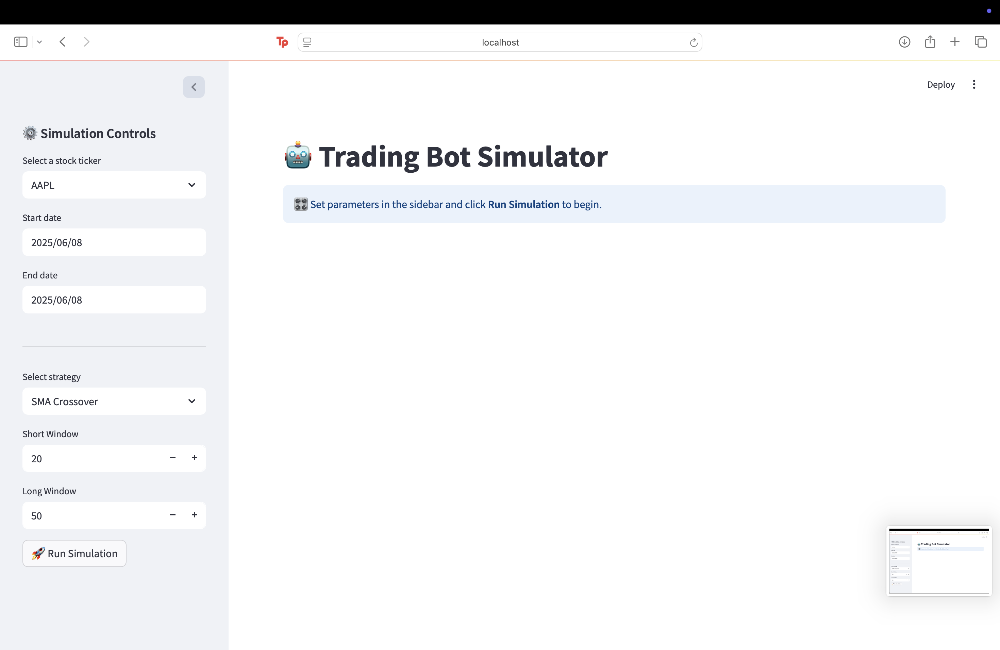
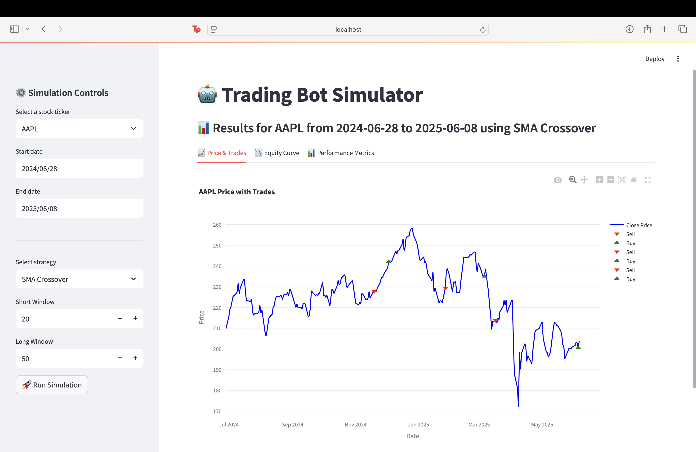
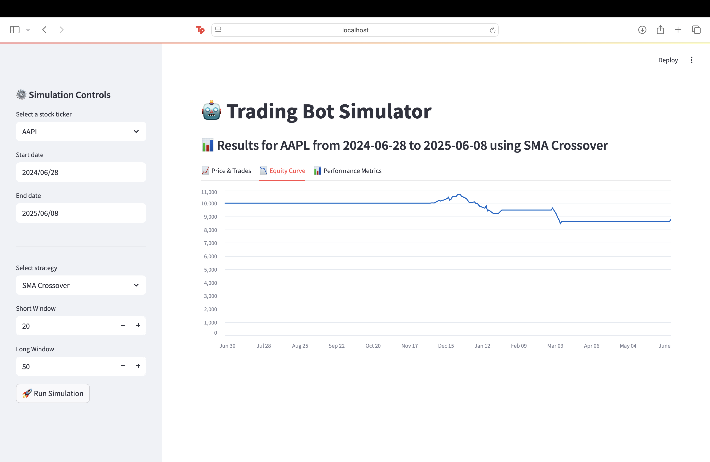
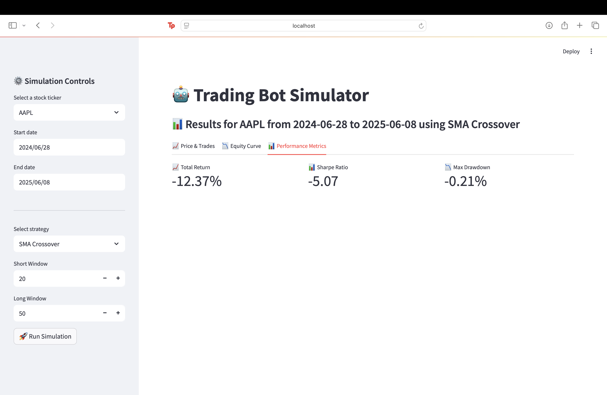

# 🤖 Trading Bot Simulator

An interactive trading strategy simulator built with Streamlit. Users can backtest multiple trading strategies on historical stock data and visualize performance.

---

## 🚀 Features

- 📈 **Real-time backtesting** of multiple strategies
- ⚙️ Customizable strategy parameters (e.g., RSI period, MACD windows)
- 📊 Performance metrics (Total Return, Sharpe Ratio, Max Drawdown)
- 🖼️ Interactive charts with buy/sell markers
- 📅 Supports historical data fetching by date

---

## 🔧 Strategies Included

1. **SMA Crossover**
2. **RSI Strategy**
3. **MACD Strategy**

---

## 🧪 How to Use

### 📦 Setup

```bash
pip install -r requirements.txt
```

### ▶️ Run the App

```bash
streamlit run app.py
```

Then open the app in your browser.

---

## 📷 Screenshots

### 1. Sidebar Controls


### 2. Price Chart with Trades


### 3. Equity Curve


### 4. Metrics Summary


---

## 📐 Metrics Explained

- **Total Return**: Overall gain/loss over the backtest period
- **Sharpe Ratio**: Return per unit of risk (higher is better)
- **Max Drawdown**: Largest peak-to-trough loss during the backtest

---

## 📁 Project Structure

```
├── app.py
├── strategies/
│   ├── sma_crossover.py
│   ├── rsi_strategy.py
│   └── macd_strategy.py
├── utils/
│   ├── data.py
│   ├── backtester.py
│   └── metrics.py
├── screenshots/
└── README.md
```

---

## 📬 Future Improvements

- Add support for more strategies (Bollinger Bands, EMA crossover)
- Include trade logs and position-level analytics
- Export results as CSV

---

## 🧑‍💻 Author

Built by Aaron Malhi — feel free to fork or contribute!
