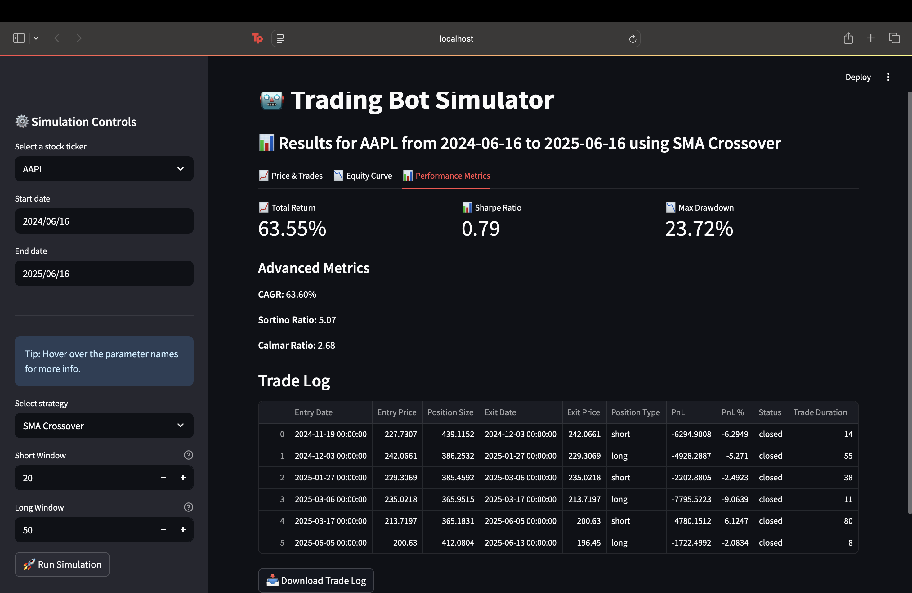

# Trading Bot Simulator

A modular, professional-grade trading strategy backtester and simulator with a clean Streamlit UI. Built for learning, portfolio, and interview prep.

## Features

- Modular strategy plug-in system (SMA Crossover, RSI, MACD, Bollinger Bands)
- Advanced performance metrics: Total Return, Sharpe, Max Drawdown, CAGR, Sortino, Calmar, etc.
- Enhanced trade log (includes trade duration)
- Clean, interactive Streamlit UI with tooltips and error handling
- Downloadable trade log (CSV)
- Easy to add new strategies or metrics

## Screenshots

| UI Overview | Performance Metrics | Trade Log |
|-------------|--------------------|-----------|
|  |  |  |

*TODO: Add more screenshots as features are added or updated.*

## How to Run

1. Clone the repo
2. Install requirements: `pip install -r requirements.txt`
3. Run the app: `streamlit run app/main.py`

## Strategies Included

- **SMA Crossover**: Buy/sell based on short/long moving average crossovers
- **RSI Strategy**: Buy/sell based on RSI overbought/oversold levels
- **MACD Strategy**: Buy/sell based on MACD and signal line crossovers
- **Bollinger Bands**: Buy when price crosses above lower band, sell when it crosses below upper band

## Performance Metrics

- Total Return
- Sharpe Ratio
- Max Drawdown
- CAGR (Compound Annual Growth Rate)
- Sortino Ratio
- Calmar Ratio
- Win Rate
- Profit Factor
- Average Trade PnL
- Trade Duration (days)

## Future Work

- Add more strategies (momentum, mean reversion, etc.)
- Portfolio/multi-asset support
- More advanced visualizations
- Parameter optimization tools
- (Your ideas here!)

## Running Tests

To run the test suite, just use:

```bash
pytest tests/
```

This will check that the core logic and strategies work as expected. Feel free to add more tests as you expand the project!

---

*Built by Aaron Malhi. Contributions and feedback welcome!*
